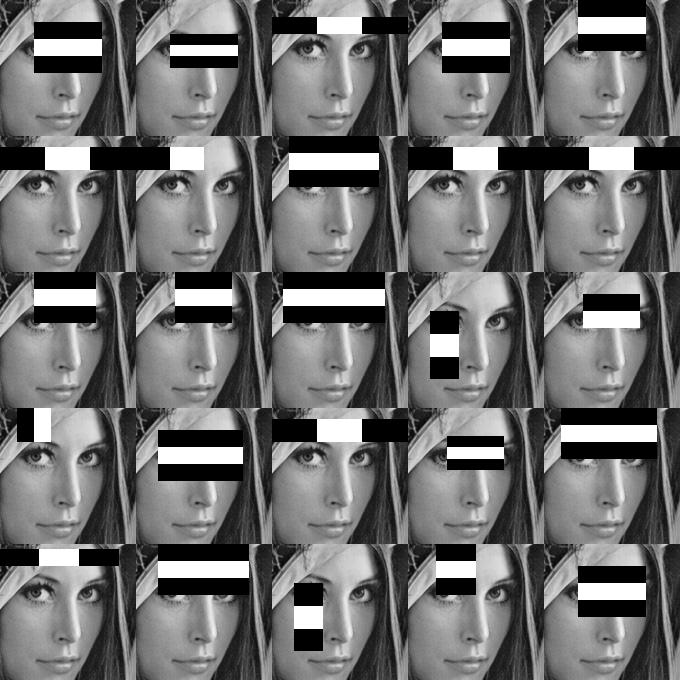

**This coursework is only for students registered on the COMP6223 module.**

## Brief
Due date: Wednesday 29th November, 16:00.  
Software tool: [Download](https://github.com/jonhare/SimpleFaceDetector/releases/download/v1.0/SimpleFaceDetector-1.0-tool.jar) | [README](https://github.com/jonhare/SimpleFaceDetector/blob/master/README.md)  
Handin: [1718/COMP6223/2/](https://handin.ecs.soton.ac.uk/handin/1718/COMP6223/2/)  
Required files: report.pdf  
Credit: 10% of overall module mark  

## Overview
Face detection algorithms such as the classic [Viola-Jones Haar Cascade algorithm](viola04ijcv.pdf) are trained to select weakly-discriminative features that are commonly present (or not present) in images for faces. For example, a common feature in images of faces is that the average intensity of a rectangular region that crosses the eyes is lighter than the region immediately above and below it. The image below shows some common discriminative features:

  
Examples of common discriminative features from a Haar cascade face detector. Taken from <a href="https://www.flickr.com/photos/unavoidablegrain/6884354772">https://www.flickr.com/photos/unavoidablegrain/6884354772</a>.
  

The aim of this coursework is for you to explore how you might camouflage a face in order for it not to be detected by software, whilst still being recognisable as a face by humans. We have provided a software implementation of a Haar cascade detector that you can use for experiments.

## Details
The use of Haar-like features coupled with a cascade of classifiers has proved to be an effective approach to object detection. The method was originally proposed by Paul Viola (Paul now works for Amazon and is Vice President of Science for the team that is working on drone deliveries!) and [Michael Jones](http://www.merl.com/people/mjones/) in their 2001 paper, ["Rapid Object Detection using a Boosted Cascade of Simple Features"](viola-cvpr-01.pdf). The technique incorporates a machine learning based approach in which a cascade function is trained from a large number of positive and negative images. The classifier learnt during the training phase is then used to detect objects in other images.

We have written a tool that is capable of using the Viola-Jones method to detect faces in still images and live videos from a web-cam. The tool is available [here](https://github.com/jonhare/SimpleFaceDetector/releases/download/v1.0/SimpleFaceDetector-1.0-tool.jar), and documentation on how to use it is [here](https://github.com/jonhare/SimpleFaceDetector/blob/master/README.md). 

For this coursework, we want you to explore how the face detector can be tricked into not detecting your face through the application of camouflage. You should take photographs of yourself and run them through the face detector we've provided to see if your face is detected. You might try investigating some of the following:

* Can you apply face-paint or make-up to subvert the detector?
* Can you wear a disguise (e.g. put on a hat, glasses, ...)?
* Can you create some form of innovative jewellery that stops the face detector finding your face?

For every type of camouflage you investigate, you should test it under a range of different poses (bearing in mind that the detector will only work for upright, near-frontal faces). Ideally, any camouflage that you design should be as non-invasive as possible and also have minimal occlusion - your face should still be detectable or visible to a human, so putting a cardboard box over your head, whilst technically subverting the detector, is not a good solution!.

### Cameras
Obviously, you'll need a camera to do this coursework! If you don't have access to a web-cam or other camera, then [ECS stores](https://secure.ecs.soton.ac.uk/kb/entry/65/) have a small number of devices available for short term loan. [Jon](http://www.ecs.soton.ac.uk/people/jsh2) also has a number of USB web-cams you can borrow for short periods.

### The report
You need to produce a short report that describes and illustrates (with photographs) your camouflage techniques. You should describe the process you went into designing the camouflage and relate its functionality to the way the Haar cascade detector works. The report should also demonstrate (through pictures) that your techniques work under a range of near-frontal face poses. The target length is ~2 sides of A4, although there won't be penalties for exceeding this, and you may find that you need more pages for pictures.

### What to hand in
You need to submit to ECS Handin the following items:

* The report (as a PDF document)

## Marking and feedback
Marks will be awarded for:

* Identifying a range of techniques to subvert the face detector implementation.
* Describing the rationale for these techniques and related them to the way the face detector works.
* Evidence of professionalism in the implementation and reporting.
* Quality and contents of the report.

Standard ECS late submission penalties apply.

Individual feedback will be given covering the above points.

## Useful links
* [The Original Viola/Jones Conference paper](viola-cvpr-01.pdf)
* [Extended journal paper](viola04ijcv.pdf)
* [Wikipedia description of the algorithm](http://en.wikipedia.org/wiki/Viola–Jones_object_detection_framework)
* The source-code for the detector software we've provided is [here](https://github.com/jonhare/SimpleFaceDetector) 
* The actual detector data is the ["haarcascade_frontalface_alt2.xml"](https://github.com/Itseez/opencv/blob/master/data/haarcascades/haarcascade_frontalface_alt2.xml) file from the [OpenCV project](www.opencv.org). 
 * Note that we're not using it with OpenCV, but rather with [OpenIMAJ](www.openimaj.org), which provides an alternative Java implementation. 
 * The detector is a "Tree-based 20x20 gentle adaboost frontal face detector", created by [Prof. Rainer Lienhart](http://www.lienhart.de/).

## Questions
If you have any problems/questions then [email](mailto:jsh2@ecs.soton.ac.uk) or speak to [Jon](http://ecs.soton.ac.uk/people/jsh2), either in his office, or in one of the drop-in sessions in the Zepler labs we'll run during the course.

