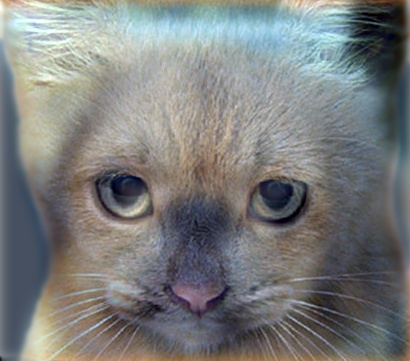
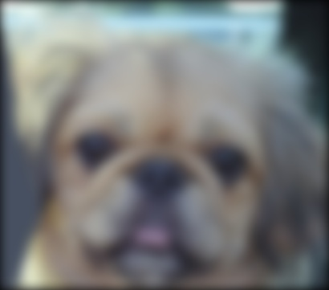
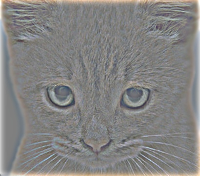
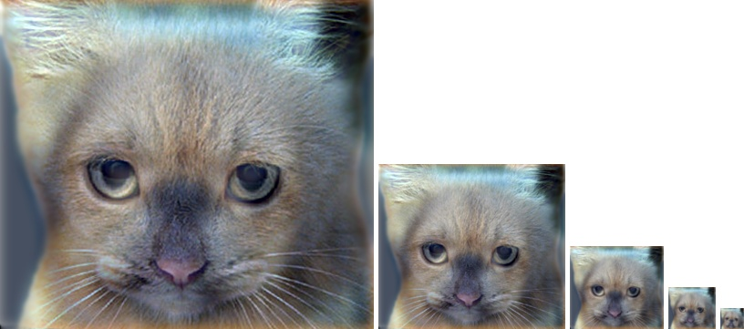

**This coursework is only for students registered on the COMP3204 module**

## Brief
Due date: Wednesday 15th November, 16:00.  
Sample images: [hybrid-images.zip](./hybrid-images.zip)  
Handin: [1718/COMP3204/2/](https://handin.ecs.soton.ac.uk/handin/1718/COMP3204/2/)  
Required files: report.pdf; code.zip  
Credit: 10% of overall module mark  

## Overview
The goal of this assignment is to write a basic image convolution function and use it to create [hybrid images](http://web.archive.org/web/20150321184824/http://cvcl.mit.edu/hybridimage.htm) using a simplified version of the [SIGGRAPH 2006 paper by Oliva, Torralba, and Schyns](http://cvcl.mit.edu/publications/OlivaTorralb_Hybrid_Siggraph06.pdf). Hybrid images are static images that change in interpretation as a function of the viewing distance. The basic idea is that high frequency tends to dominate perception when it is available, but, at a distance, only the low frequency (smooth) part of the signal can be seen. By blending the high frequency portion of one image with the low-frequency portion of another, you get a hybrid image that leads to different interpretations at different distances. An example of a hybrid image is shown below.

  
Example hybrid image. Look at image from very close, then from far away.  

## Details
This project is intended to familiarise you with image filtering and the implementation of a convolution function in OpenIMAJ. Once you have created an image convolution function, it is relatively straightforward to construct hybrid images. You will need to have worked through [Chapter 1](http://www.openimaj.org/tutorial/getting-started-with-openimaj-using-maven.html), [Chapter 2](http://www.openimaj.org/tutorial/processing-your-first-image.html) and [Chapter 7](http://www.openimaj.org/tutorial/processing-video.html) of the [OpenIMAJ tutorial](http://www.openimaj.org/tutorial/) prior to starting this coursework.

**Template convolution.** Template convolution is a fundamental image processing tool. Mark has covered convolution in detail in the lectures. See section 3.4.1 of [Mark's book (Third Edition)](http://ecs.soton.ac.uk/~msn/book/worksheets.html) ("Template Convolution") and the lecture materials for more information. 

OpenIMAJ has numerous built in and highly efficient operators to perform convolution, but you will be writing your own such function from scratch for this assignment. More specifically, you will implement a class called `MyConvolution` that builds on this skeleton:

	import org.openimaj.image.FImage;
	import org.openimaj.image.processor.SinglebandImageProcessor;

	public class MyConvolution implements SinglebandImageProcessor<Float, FImage> {
		private float[][] kernel;

		public MyConvolution(float[][] kernel) {
			this.kernel = kernel;
		}

		@Override
		public void processImage(FImage image) {
			// convolve image with kernel and store result back in image
			//
			// hint: use FImage#internalAssign(FImage) to set the contents
			// of your temporary buffer image to the image.
		}
	}

You will need to fill in the `processImage` method so that it performs convolution of the image with the kernel/template. Your implementation must support arbitrary shaped kernels, as long as both dimensions are odd (e.g. 7x9 kernels but not 4x5 kernels). The border pixels should be set to 0.

Note that the code you write for template convolution is designed to work on grey-level images (`FImage`), however the images you will process in the next section are colour (`MBFImage`). Convolution of a colour image is performed by separately convolving each of the colour bands. OpenIMAJ will automatically take care of this for you when you pass your `MyConvolution` instance to the `process` method of an `MBFImage`.

**Hybrid Images.** A hybrid image is the sum of a low-pass filtered version of the one image and a high-pass filtered version of a second image. There is a free parameter, which can be tuned for each image pair, which controls *how much* high frequency to remove from the first image and how much low frequency to leave in the second image. This is called the "cutoff-frequency". In the paper it is suggested to use two cutoff-frequencies (one tuned for each image) and you are free to try that, as well. 

Low pass filtering (removing all the high frequencies) can be achieved by convolving the image with a Gaussian filter. The cutoff-frequency is controlled by changing the standard deviation, sigma, of the Gaussian filter used in constructing the hybrid images. You can use the `Gaussian2D.createKernelImage(size, sigma)` method to create a image of a 2D Gaussian, and use the `pixels` field of the resultant image to get the 2D float array required for your `MyConvolution` constructor. The `size` parameter of `Gaussian2D.createKernelImage(size, sigma)` controls the width and height of the filter in pixels. It is standard practice for this to be set as a function of the sigma value as follows:

	int size = (int) (8.0f * sigma + 1.0f); // (this implies the window is +/- 4 sigmas from the centre of the Gaussian)
	if (size % 2 == 0) size++; // size must be odd

High pass filtering (removing all the low frequencies) can be most easily achieved by subtracting a low-pass version of an image from itself.

We have provided you with 5 pairs of aligned images (in the [hybrid-images.zip](./hybrid-images.zip) file) which can be merged reasonably well into hybrid images. The alignment is important because it affects the perceptual grouping (read the paper for details). We encourage you to create additional examples (e.g. change of expression, morph between different objects, change over time, etc.). See the [hybrid images project page](http://web.archive.org/web/20150321184824/http://cvcl.mit.edu/hybridimage.htm) for some inspiration.

For the example shown at the top of the page, the two original images look like this:

   

The low-pass (blurred) and high-pass versions of these images look like this:

   

The high frequency image is actually zero-mean with negative values so it is visualised by adding 0.5 to every pixel in each colour channel. In the resulting visualisation, bright values are positive and dark values are negative.

Adding the high and low frequencies together gives you the image at the top of this page. If you're having trouble seeing the multiple interpretations of the image, a useful way to visualise the effect is by progressively down-sampling the hybrid image as is done below:

  

The OpenIMAJ [Image#drawImage](http://openimaj.org/apidocs/org/openimaj/image/Image.html#drawImage(I,%20int,%20int)) methods can be used in combination with the image resizing functionality found in the [ResizeProcessor](http://openimaj.org/apidocs/org/openimaj/image/processing/resize/ResizeProcessor.html) or [BilinearInterpolation](http://openimaj.org/apidocs/org/openimaj/image/processing/resize/BilinearInterpolation.html) classes to construct such a visualisation.

### Restrictions
You can use the convolution functions built in to OpenIMAJ for testing (e.g. [FGaussianConvolve](http://openimaj.org/apidocs/org/openimaj/image/processing/convolution/FGaussianConvolve.html), [FConvolution](http://openimaj.org/apidocs/org/openimaj/image/processing/convolution/FConvolution.html), etc), but do not use them in your implementation.

### The report
You need to prepare a short report (target length is ~2 sides of A4, although there won't be penalties for exceeding this). In the report you need to describe your convolution and hybrid images algorithms (in particular, please include your code for the convolution implementation) and any decisions you made to write your algorithms in a particular way. Then you should show and discuss the results of your algorithm, showing the results of your hybrid images algorithm (showing the image at a range of scales to show the effect) and show some of the intermediate images in the hybrid image pipeline (e.g. the low and high frequency images). Also, discuss anything extra you did. Feel free to add any other information you feel is relevant.

### What to hand in
You need to submit to ECS Handin the following items:

* The report (as a PDF document)
* Your code enclosed in a zip file (include everything we would need to build and run it; please don't include the Maven 'target' directory!)

## Marking and feedback
Marks will be awarded for:

* Successful implementation of the convolution and hybrid images algorithms.
* Providing a good demonstration of your hybrid images algorithm.
* Good use of the OpenIMAJ library.
* Well structured and commented code.
* Evidence of professionalism in implementation and reporting.
* Quality and contents of the report.

Standard ECS late submission penalties apply.

Individual feedback will be given covering the above points.

## Useful links
* [The OpenIMAJ Tutorial](http://openimaj.org/tutorial)
* [The OpenIMAJ Javadocs](http://openimaj.org/apidocs/index.html)
* [SIGGRAPH Hybrid Images Paper](http://cvcl.mit.edu/publications/OlivaTorralb_Hybrid_Siggraph06.pdf)
* [The Hybrid Images project page](http://web.archive.org/web/20150321184824/http://cvcl.mit.edu/hybridimage.htm)

## Questions
If you have any problems/questions then [email](mailto:jsh2@ecs.soton.ac.uk) or speak to [Jon](http://ecs.soton.ac.uk/people/jsh2), either in his office, or in one of the drop-in sessions in the Zepler labs we'll run during the course.

